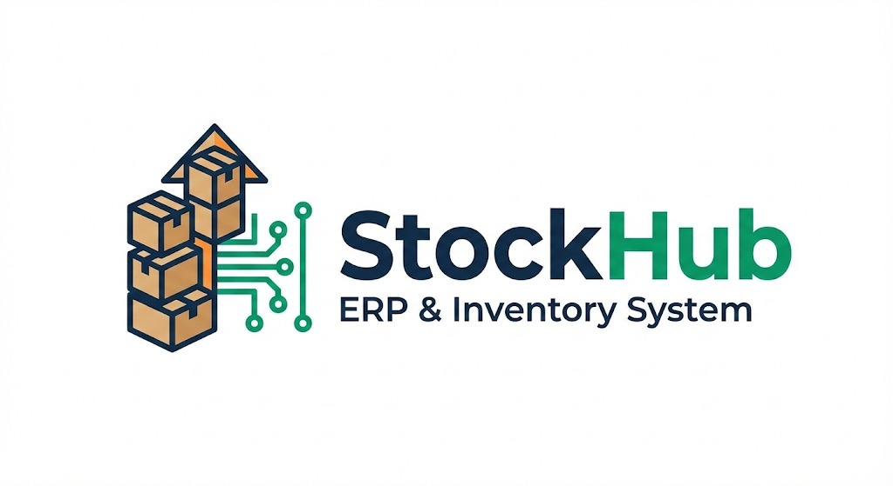

<p align="center">
  
</p>

<h1 align="center">StockHub ERP System</h1>

<p align="center">
  <strong>A Full-Stack Enterprise Resource Planning system integrating real-time inventory management with automated double-entry accounting.</strong>
</p>

<p align="center">
  
  
  
  
</p>

---


## Overview

**StockHub** is designed to solve a classic business operational challenge: the discrepancy between physical stock in warehouses and financial reports. The system serves as a **Single Source of Truth**, where every inventory movement (inbound, outbound, or adjustment) automatically triggers accounting journal entries (Debit/Credit) in the background.

This ensures that Profit & Loss statements and asset values remain accurate in real-time without requiring duplicate manual entries.

---

## Key Features

### 1. Automated Double-Entry Accounting

The core feature that distinguishes StockHub. Utilizing the **Service Object Pattern** on the backend to handle complex business logic, ensuring every inventory transaction generates balanced journal entries (ACID Compliant).

**Example Flow:**
```
Purchase Order → Stock Increases → Auto Journal Entry
  Debit: Inventory Asset
  Credit: Accounts Payable
```

### 2. Real-time Inventory Management

- **Stock Inbound (Procurement)**: Record incoming inventory with automatic COGS calculation
- **Stock Outbound (Sales)**: Track sales and automatically adjust inventory levels
- **Stock Adjustment**: Manual adjustments with full audit trail
- **Low Stock Alert System**: Automatic notifications when inventory reaches minimum threshold
- **Multi-location Support**: Track inventory across multiple warehouses

### 3. Executive Dashboard & Analytics

Centralized data visualization for quick decision-making:

- **Real-time Asset Valuation**: Total inventory value at a glance
- **Top Inventory Trends**: Visual charts showing stock level patterns
- **Financial Performance Summary**: Revenue, Cost of Goods Sold, and Gross Profit metrics
- **Activity Feed**: Recent transactions and system events
- **Customizable Widgets**: Personalize your dashboard view

### 4. Operational Efficiency & Security

- **Supplier Integration**: Click-to-order via WhatsApp directly from dashboard for quick restocking
- **Audit Trail (System Logs)**: Records every user activity (Who, What, When) for security and data transparency
- **User Management & Authentication**: Secure access using JWT (JSON Web Token)
- **Role-Based Access Control**: Different permission levels for different user types
- **Data Export**: Export reports in CSV, Excel, and PDF formats

---

## 🛠️ Technology Stack

Built using a **Monorepo architecture** with clear separation between Backend API and Frontend Client.

### Backend (API Service)

| Technology | Purpose |
|------------|---------|
| **Ruby on Rails** | API Framework |
| **PostgreSQL** | Database |
| **JWT** | Authentication |
| **Rack-CORS** | Cross-Origin Resource Sharing |
| **ActiveRecord** | ORM & Database Transactions |

**Key Patterns:**
- Service Objects (for isolated accounting business logic)
- Repository Pattern (for data access)
- Active Record Transactions (for data consistency)

### Frontend (Client Application)

| Technology | Purpose |
|------------|---------|
| **React** | UI Framework |
| **Vite** | Build Tool & Dev Server |
| **Tailwind CSS** | Styling Framework |
| **React Router** | Client-side Routing |
| **Axios** | HTTP Client |
| **Recharts** | Data Visualization |
| **Lucide React** | Icon Library |

**State Management:**
- React Context API (for global state)
- Custom Hooks (for reusable logic)
